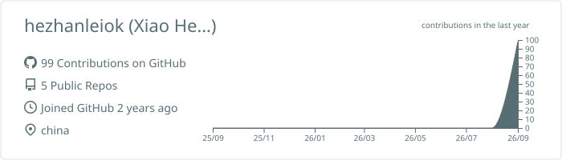
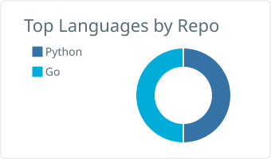

### 👋 Hi there, I'm Xiao He (小何)

> 热爱技术与分享，专注于 Cloudflare、VPS、自动化运维、免费资源以及 AI 应用探索。

---

### 🌐 个人频道与社交主页
欢迎关注我的各大平台，获取最新技术分享：

  <!-- 博客网站 -->
  
  <!-- YouTube 频道 -->
  
  <!-- X (Twitter) -->
  
  <!-- Telegram -->
  

---

### 📊 GitHub 实时数据统计
*(通过 GitHub Actions 每日自动更新)*

  <!-- 基础个人数据概览卡片 -->
  
  
  <!-- 常用编程语言仓库占比卡片 -->
  

---

### 🛠️ 技术栈与工具
* **云服务 & 边缘计算**：Cloudflare (Workers / Pages), Vercel, VPS 运维
* **建站与工具**：Hexo, Git, Markdown, 各种效率脚本
* **AI 应用**：Suno 音乐创作、日常 AI 提效工具
